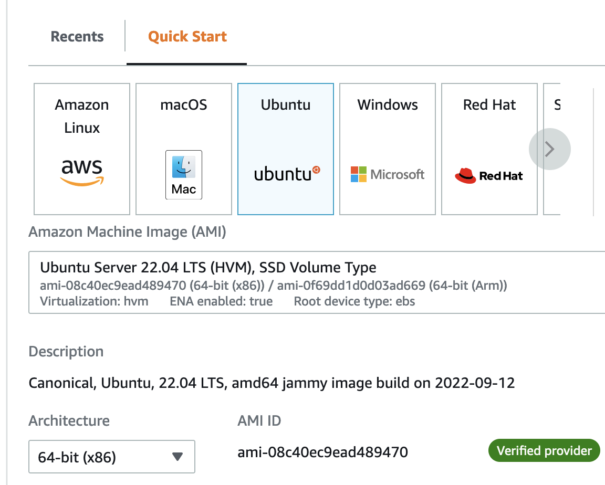
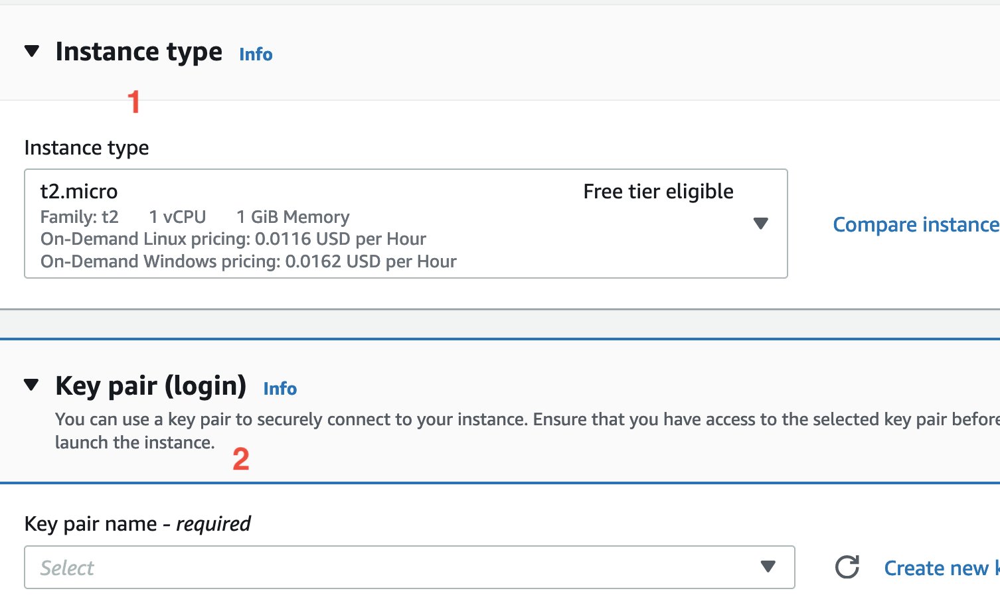
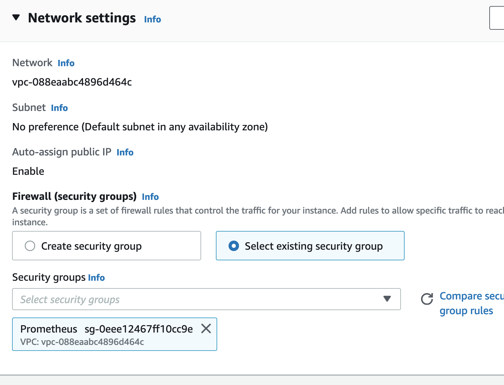
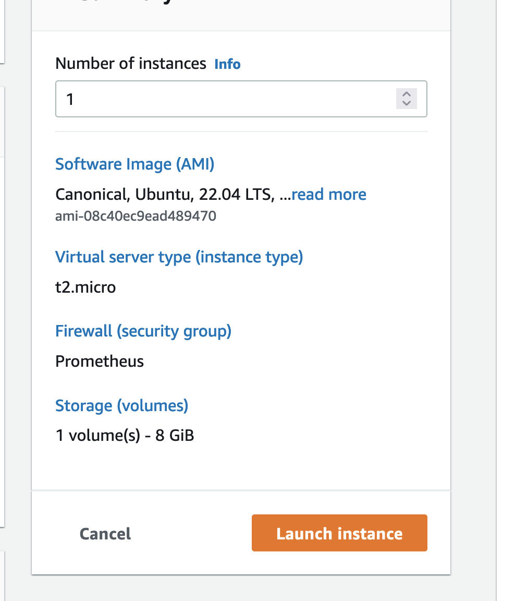
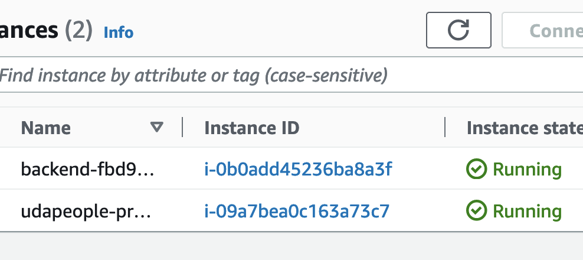
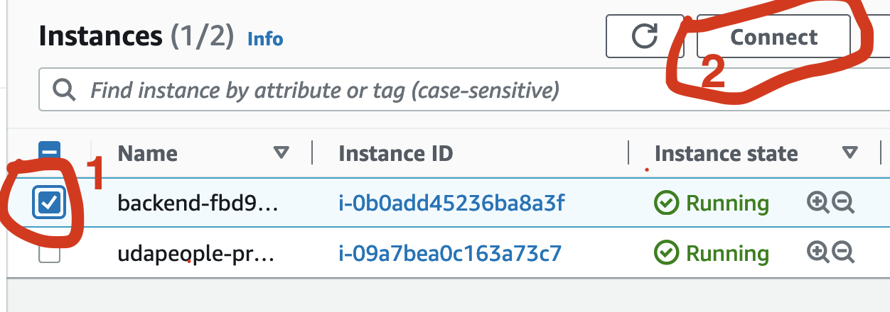
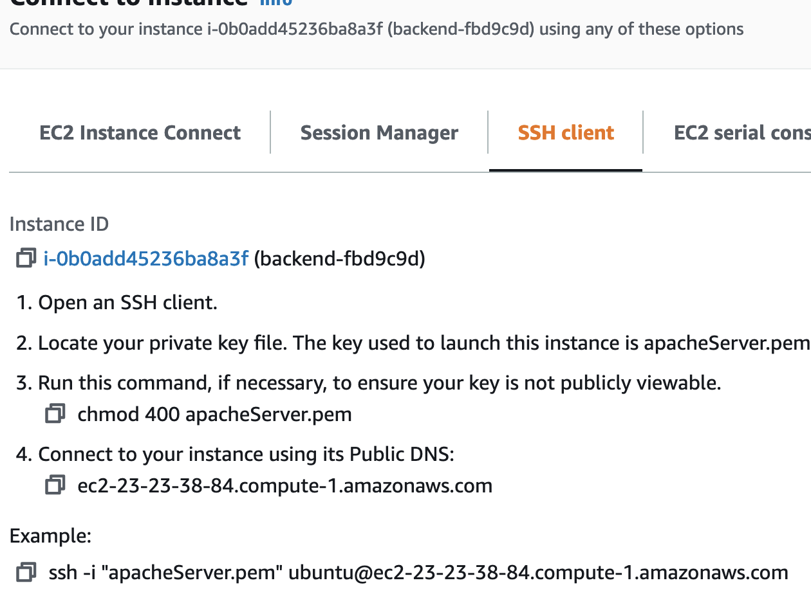
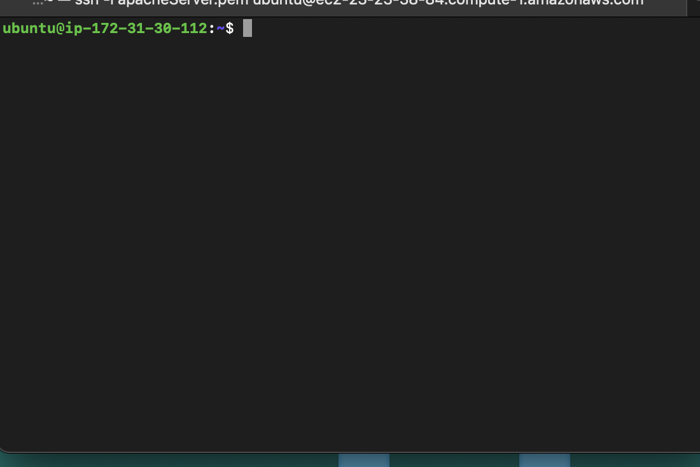

## Create Ec2 Instance Using Aws Console
There are multiple way EC2 instance can be created but the console seems like the most convenient way for beginners. There are multiple steps to consider when creating EC2 for prometheus(monitorin server) setup which are listed below


### Pre-Steps
* Create Key-pair with any name - eg `prometheus_key.pem` replace with your key name
* Create Security Group with name of your choice `prometheus` with Ingress rules of the following
```
Type : Custom-TCP
Port range : 9090 , 9100, 9093
CIDR Block : 0.0.0.0/0

```

### Steps To Create Instance
#### 1. Select Region 
Select the region you will like to create your instance eg `us-east-1a`

Nagivate to [AWS Console](https://us-east-1.console.aws.amazon.com/ec2/home?region=us-east-1#LaunchInstances:)

#### 2. Select Instance AMI (AMAZON MACHINE IMAGE)
I Suggest Ubuntu image with free tier eligible




#### 3. Select Instance Type 
This section shows the computing, memory, networking and storage of the instance you are creating.
Note - `t2.micro free tier eligible is recommended`




#### 4. Select key-pair you create ealier named - `Prometheus.pem`
This is the key that will be used to ssh to your instance incase needs be.
Note - `prometheus.pem` you created should be used or create new one on the spot


#### 5. Network Setting - `prometheus` created previously
A security group is a set of firewall rules that control the traffic for your instance. Add rules to allow specific traffic to reach your instance. 
 
Here we will select the `prometheus` security group we created ealier with ingress rules of `9090`, `9100`, `9093`




#### 6 Storage configuration and Advance Details
The above mentioned can be left as default for the monitoring server we are creating.


#### 7 Preview Summary and Launch Instace
Go through the summary and launch if everything seems fine.




#### 8 Final Stage - preview Instance and ensure it state shows `Running` stage


#### 9 Extra - SSH into instance
This step required you to follow the instruction below.
1. Select and connect to your instance to see instructions.




2. SSH nagivate to your terminal where your key pair file is download, mostly to your download directory.
Type `cd ~/Download` on linus system (mac)

3. Follow the instruction below 




4 Finally 
if you see the root name change from yours to the AMI name then you are good




## Thank You and see you in the next post ):
#### Next - ` Configure Promtheus on EC2 Instannce `
[Prometheus](..//Prometheus_setUp/README.md) 