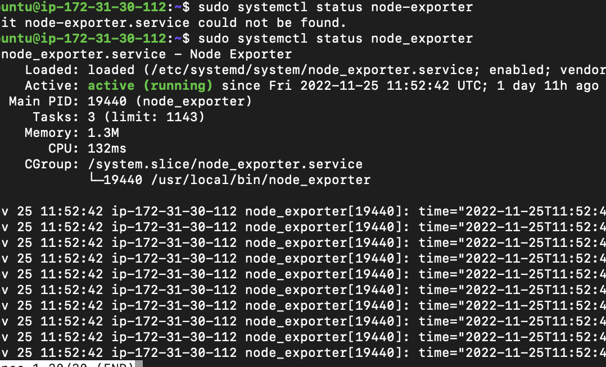
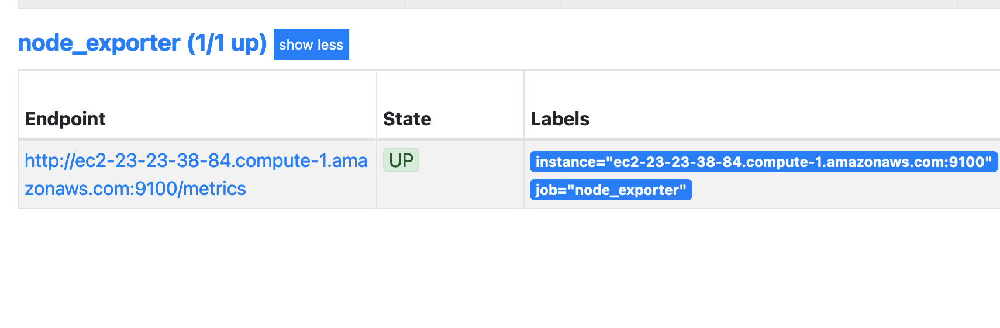

## Configuring Prometheus Node Exporter on AWS EC2
The step is basicaly use to export data on created new instance and configure created prometheus server to recieve and monitor the server base on the  data recieved


### Prerequisites
1. Create prometheus server [ec2 instance](../CreateAWSInstance/README.md)
2. Configure Prometheus on server [Prometheus_configuration](../Prometheus_setUp/README.md)
3. Create a new instance to be monitor by following ` prerequisite 1 `

` Ensure that Secury group of port 9100 is part of the ingress rule ` 


### Steps
The below steps will be consigured after which the prerequisite have been completed


#### 1.  SSH into your new ec2 instance ` Instance to be monitor `

```
ssh -i prometheus.pem ubuntu@ec2-3-17-28.53.us-east-2.compute.amazonaws.com

```
Please replace the ` prometheus.pem ` with your key pair downloaded and also change ` ubuntu@ec2-3-17-28.53.us-east-2.compute.amazonaws.com ` to your dnsName


#### 3. Create a new user
it was recommended to create a new user aside the root user for security measures which we will be using to run our prometheus service

```
sudo useradd --no-create-home node_exporter

```


### 4. Install Node Exporter ` new instance ` annd move the binaries to another directories

```
wget https://github.com/prometheus/node_exporter/releases/download/v1.0.1/node_exporter-1.0.1.linux-amd64.tar.gz
tar xzf node_exporter-1.0.1.linux-amd64.tar.gz
sudo cp node_exporter-1.0.1.linux-amd64/node_exporter /usr/local/bin/node_exporter
rm -rf node_exporter-1.0.1.linux-amd64.tar.gz node_exporter-1.0.1.linux-amd64

```


#### 5. Create and configure node exporter service

```

sudo vi /etc/systemd/system/node-exporter.service

```

copy and paste below  to the editor file created  above

```

[Unit]
Description=Prometheus Node Exporter Service
After=network.target

[Service]
User=node_exporter
Group=node_exporter
Type=simple
ExecStart=/usr/local/bin/node_exporter

[Install]
WantedBy=multi-user.target

```


#### 6. Configure and run systemd

```

sudo systemctl daemon-reload
sudo systemctl enable node-exporter
sudo systemctl start node-exporter

```


#### 7. Check status

```

sudo systemctl status node-exporter

```



# Finish but Continue - The node exporter installation is finish here 
The below steps is use to configure prometheus server to recieved the exported data and monitor


### Prometheus Configuration Improvement
Further installation is required to be configure for the previous  instance [` Prometheus Server `](../Prometheus_setUp/README.md) so that he can collect the  exported  dat and monitor the new created server as well


### Follow along please
* SSH  into the previously created prometheus server
```
ssh -i prometheus.pem ubuntu@ec2-3-17-28.53.us-east-2.compute.amazonaws.com

```
Please replace the ` prometheus.pem ` with your key pair downloaded and also change ` ubuntu@ec2-3-17-28.53.us-east-2.compute.amazonaws.com ` to your dnsName


* Open The Prometheus yml file and paste the code that follows
 - ` sudo vi /etc/prometheus/prometheus.yml `

 ```

global:
  scrape_interval: 15s
  external_labels:
    monitor: 'prometheus'

scrape_configs:

  - job_name: 'node_exporter'

    static_configs:

      - targets: ['ec2-13-58-127-241.us-east-2.compute.amazonaws.com:9100']

 ```

Note : exit the editor with command key  - ` esc ` follow by keys - ` shift :x ` and ` Enter ` command


* Restart Prommetheus Service

```
sudo systemctl restart prometheus

```


### 9. Preview Prometheus on the web
Now that the status is showing running  then we can view in the browser using  the DNS_NAME or public_ip address at port 9090/tagets
