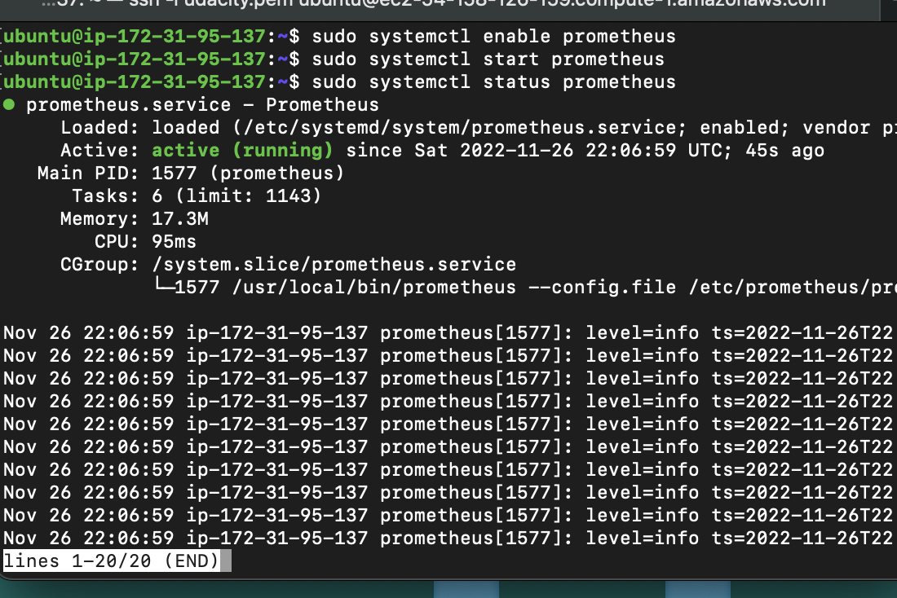
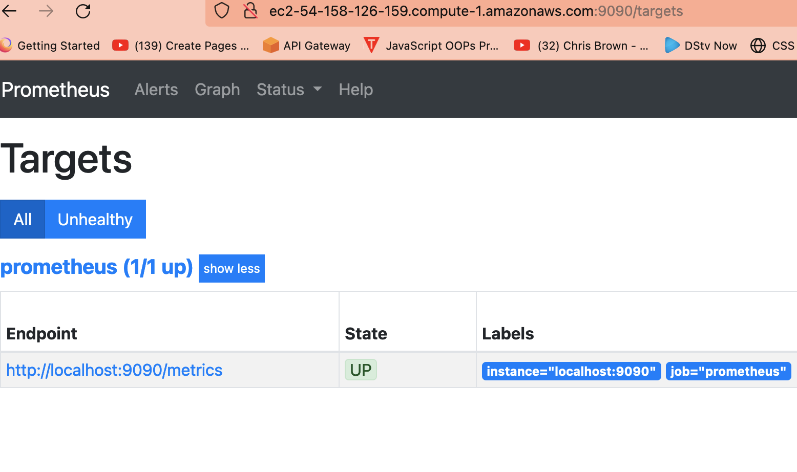

## Prometheus SetUp on AWS Ubuntu-ec2 instance
[Prometheus](https://prometheus.io/) is an open-source tool for monitoring servers and are designed for reliability which can be use for quick diagonose in a server.

This section will put us through on how to install and run prometheus on AWS ec2 instance and further more on how to pull an exported data from other aws ec2 instance.


### Prerequisite 
The only prerequisite needed for the job/setup is creating an Ubuntu server under AWS which you can checkout in the link below 
* Create EC2 Instance [Using AWS Console](../CreateAWSInstance/README.md) 


### Steps
The below steps will guide us on how we can create and run prometheus on aws EC2 ` Ubuntu Server `


#### 1. Create An Ec2 instance 
The above mentioned is very important and you can follow this link: [Using AWS Console](../CreateAWSInstance/README.md) 


#### 2. SSH into your ec2 instance
SSH into your instance from your command prompt where your key pair is downloaded which is showned in the ending part of the previous step ` Step 1 `
```
ssh -i prometheus.pem ubuntu@ec2-3-17-28.53.us-east-2.compute.amazonaws.com

```
Please replace the ` prometheus.pem ` with your key pair downloaded and also change ` ubuntu@ec2-3-17-28.53.us-east-2.compute.amazonaws.com ` to your dnsName


#### 3. Create a new user
it was recommended to create a new user aside the root user for security measures which we will be using to run our prometheus service

```
sudo useradd --no-create-home prometheus

```

Also create 2 directory under ` etc ` and ` var ` to send all prometheus neccessary files to

```
sudo mkdir /etc/prometheus
sudo mkdir /var/lib/prometheus

```


#### 4. Downnload Prometheus and send files to neccessary directories
```

# Install Prometheus
wget https://github.com/prometheus/prometheus/releases/download/v2.19.0/prometheus-2.19.0.linux-amd64.tar.gz
tar xvfz prometheus-2.19.0.linux-amd64.tar.gz

# Move and Copy Downloaded Files  
sudo cp prometheus-2.19.0.linux-amd64/prometheus /usr/local/bin
sudo cp prometheus-2.19.0.linux-amd64/promtool /usr/local/bin/
sudo cp -r prometheus-2.19.0.linux-amd64/consoles /etc/prometheus
sudo cp -r prometheus-2.19.0.linux-amd64/console_libraries /etc/prometheus

sudo cp prometheus-2.19.0.linux-amd64/promtool /usr/local/bin/
rm -rf prometheus-2.19.0.linux-amd64.tar.gz prometheus-2.19.0.linux-amd64

```


#### 5. Create a prometheus file YAML file to run prometheus to monitor instances/servers
Prometheus can be used to monitor itself by copying the below command inside the created file
* The command ` vi ` can be used to create and open the file  for editing
```
sudo vi /etc/prometheus/prometheus.yml

```

* Paste the below code inside the file,
this code will monitor the server/inself under port 9090 at interval of 15s

```

global:
  scrape_interval: 15s
  external_labels:
    monitor: 'prometheus'

scrape_configs:
  - job_name: 'prometheus'
    static_configs:
      - targets: ['localhost:9090']

```
Note : exit the editor with command key  - ` esc ` follow by keys - ` shift :x ` and ` Enter ` command


#### 5. Running prometheus as a service on it own 
This step  will help to restart prometheus autommatically anything we reboot the sytem/server
* Create a new file called ` prometheus.service `

```
 sudo vi /etc/systemd/system/prometheus.service

```


* Paste the below code

```
[Unit]
Description=Prometheus
Wants=network-online.target
After=network-online.target

[Service]
User=prometheus
Group=prometheus
Type=simple
ExecStart=/usr/local/bin/prometheus \
    --config.file /etc/prometheus/prometheus.yml \
    --storage.tsdb.path /var/lib/prometheus/ \
    --web.console.templates=/etc/prometheus/consoles \
    --web.console.libraries=/etc/prometheus/console_libraries

[Install]
WantedBy=multi-user.target

```


####  6. Let change the permision of some dir, files and binaries we just included in the server

```
sudo chown prometheus:prometheus /etc/prometheus
sudo chown prometheus:prometheus /usr/local/bin/prometheus
sudo chown prometheus:prometheus /usr/local/bin/promtool
sudo chown -R prometheus:prometheus /etc/prometheus/consoles
sudo chown -R prometheus:prometheus /etc/prometheus/console_libraries
sudo chown -R prometheus:prometheus /var/lib/prometheus

```


#### 7.  Let run the  systemd

```
sudo systemctl daemon-reload
sudo systemctl enable prometheus
sudo systemctl start prometheus

```


### 8. Check status of the systemd

```
 sudo systemctl status prometheus

```




### 9. Preview Prometheus on the web
Now that the status is showing running  then we can view in the browser using  the DNS_NAME or public_ip address at port 9090/tagets




###  Thank you for checking this out and stay tuned for more.